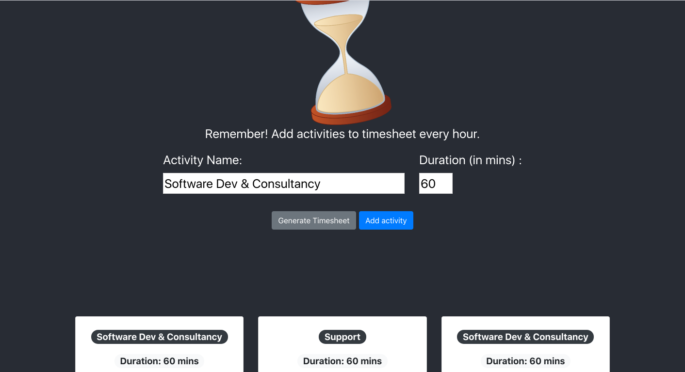

## TimeSheetDone

Simple timesheet application built with ReactJS, Mobx state management and tensorflow. 
The application identify users with camera (after registration) and allow users to create timesheet entries. 

This project was bootstrapped with [Create React App](https://github.com/facebook/create-react-app).

In the project directory, you can run:

### `npm start`

Runs the app in the development mode. 
Open [http://localhost:3000](http://localhost:3000) to view it in the browser.

